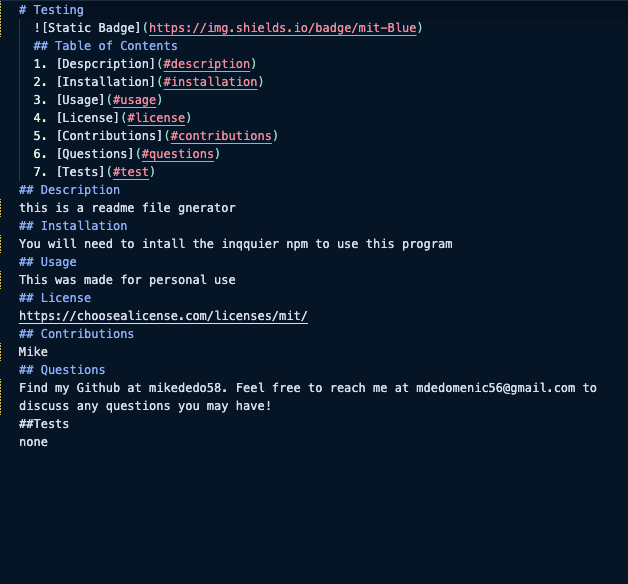

# README.md Generator

## Table of Contents

1. [Despcription](#description)
2. [Installation](#installation)
3. [Usage](#usage)
4. [License](#license)
5. [Contributions](#contributions)
6. [Questions](#questions)
7. [Tests](#test)

## Description

this is a readme generator. I used the inquirer npm to generate the questions in the prompt and a write to file function to render it. The goal was to automate the creation of readme file generations. In this project I learned a lot about badges, table of contents, and npm in general. Some of the challenges was the markdown function generation and rednering the license.

## Installation

you will need to install inthe inquirer npm to run this program.

## Usage

This is for personal use to make readme files
Here is a link to the video: https://drive.google.com/file/d/1jk-Jb3RHPloa5qNCUstRB7LFIBcJsmKZ/view
Below are screenshots:

Here is the repo: https://github.com/mikededo58/readme-creator

## Contributions

## Questions

Find my Github at https://github.com/mikededo58 Feel free to reach me at mdedomenic56@gmail.com to discuss any questions you may have!
##Tests
nope
